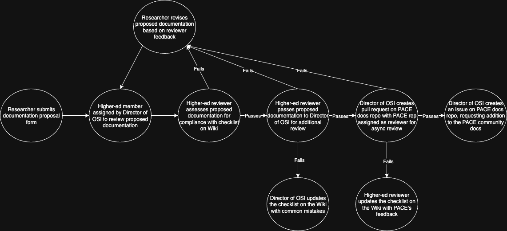

# HAAG PACE Tutorials

**Maintained By:** Charlie Clark (cclark339@gatech.edu), Anthony Trevino (atrevino35@gatech.edu) \
**Date Started:** April 21, 2025 (Spring 2025 semester)

## Description

Here, we store our tutorials on using different tools and resources on PACE, before sending them out to be used in PACE's community notes. The [proposed](./proposed/) folder contains all proposed tutorials: those which haven't passed either HAAG's internal quality control or PACE's requirements. The [approved](./approved/) folder contains all apprived tutorials: those which have successfully passed both HAAG's interal quality control and PACE's requirements.

## Pipeline Visualization

Below is a flow diagram depicting our (updated) procedure for submitting, reviewing, and proposing documentation for PACE's community notes.

