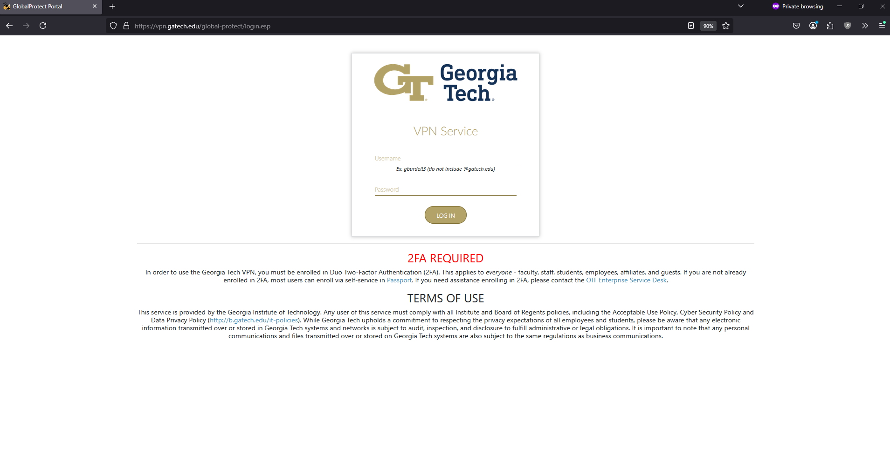
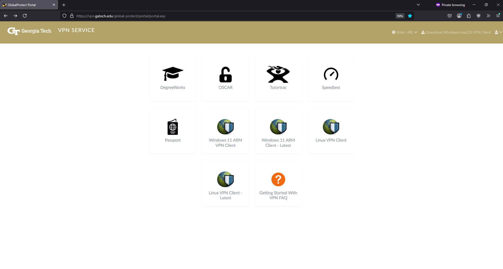
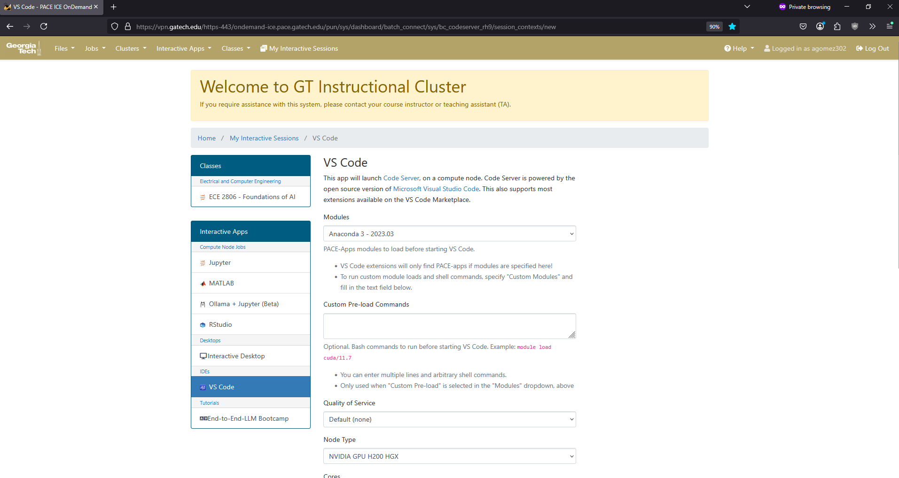

# Accessing GT's PACE ICE

## Step 1: Log into the In-Browser VPN

1. Go to: https://vpn.gatech.edu/global-protect/login.esp  
2. Authenticate with GT credentials and Duo  
3. You will be redirected to: https://vpn.gatech.edu/global-protect/portal/portal.esp  
4. Reference images:  
   -   
   -   

## Step 2: Open the OnDemand ICE Dashboard

1. Navigate to: https://vpn.gatech.edu/https-443/ondemand-ice.pace.gatech.edu/pun/sys/dashboard/batch_connect/sys/bc_codeserver_rh9/session_contexts/new  
2. Re-authenticate if prompted  
3. You should see a configuration page:  
   -   

## Step 3: Configure the Session

Adjust the following fields:

- **Node Type**: `NVIDIA GPU H200 HGX` or similar
- **Cores**: `24`
- **Memory**: `48 GB`
- **GPUs**: `2`
- **Number of hours**: `4` (Recommended: 2–4 hours)

## Step 4: Start Working in Scratch Directory

1. Open terminal in VS Code  
2. Navigate to scratch directory:
   ```bash
   cd scratch
   ```
3. Check available quota:
   ```bash
   pace-quota
   ```

**Notes:**

The scratch directory provides ~300 GB of space; therefore, it's suggested you use this directory for most development work.
